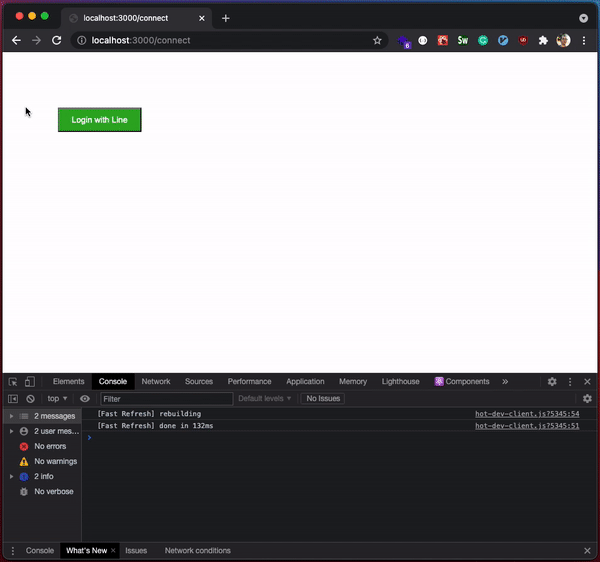

# 🔐 nextjs-express-oauth

Sample project used to illustrate the [OAuth 2.0 authorization code grant flow](https://datatracker.ietf.org/doc/html/rfc6749) using ReactJS (NextJS) and expressJS.

✅ Using [Line LOGIN v2.1](https://developers.line.biz/en/reference/line-login/) but can be use for every other auth provider supporting the [OAuth 2.0 authorization code grant flow](https://datatracker.ietf.org/doc/html/rfc6749)

✅ Using NextJS and React but is very flexible to be accommodated with every language/technology

✅ Using the `state` mechanism preventing [Cross Site Request Forgery (CSRF)](https://owasp.org/www-community/attacks/csrf)

✅ Only returning the `access_token` for the sake of the demo. Profile data / database operations can be performed on the [/api](/api) at will

## Project

This project is hosting both:
- the front-end [/www](www/) 
- and the API [/api](/api).

## Improvements

Feel free to contribute or open an issue to discuss it.

## Contact

Florian Ludot - [florian@avanssion.com](florian@avanssion.com)

Made by [Avanssion](www.avanssion.com)
